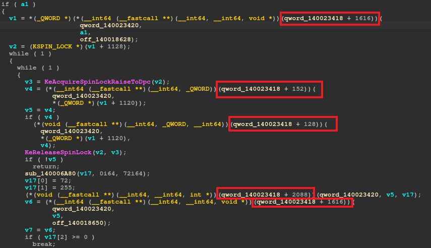
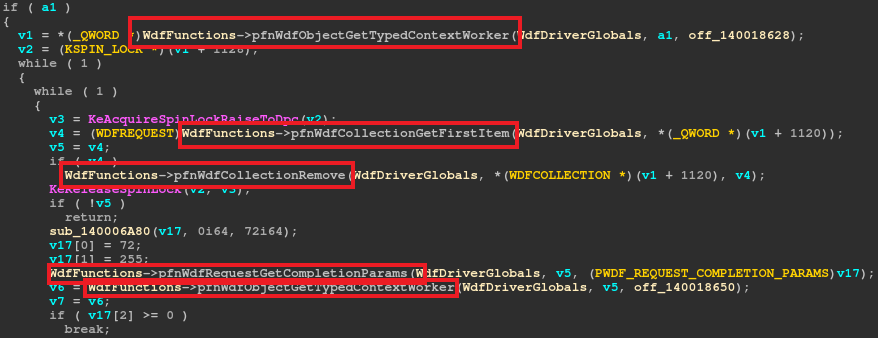

# IDA kmdf 

This plugin provides two main features:

* the .til (type library) file generation based on the WDK headers published by Microsoft
* the application of the types previously generated all along the IDB of a KMDF driver

This plugin helps the reverser and offers some comfort at the beginning of an analysis (particularly on the preliminary steps).

After the generation of the TIL files, no specific action is required to use the plugin, it is executed automatically during the IDB creation.

# Showcase

To show what the plugin can bring to your preferred IDB, here is an example.



In the pseudocode generated by Hexrays, it is observed that some variables (specific to KMDF) are not typed. Thus, the function calls using function pointers are not easy to understand, yet.
It would be possible to use the WDK types to obtain a better readability.

Here is the same code after the plugin execution (and the automatic type application):



Finally, we clearly have a better pseudocode and the real analysis can start!

# Prerequisites

* IDA Python
* IDA 8.3
* IDA SDK (tilib)
* Microsoft WDK
* Microsoft SDK
* clone of Windows-Driver-Frameworks

# Repository

In the repository, there is five set of files :

* `wdfalyzer.py`: the main interface to generate TIL and apply them to an IDA database (headlessly).
* `wdf_plugin/`: the plugin that will be executed at the start of IDA to apply types transparently.
* `wdf_til_creation/`: the TIL creator is used to generate TIL files from the WDK and the KMDF. Having the TIL files is a prerequisite to apply its types to the database.
* `utils/`: a helpful generic script to execute IDA script headlessly.
* `wdf_til`: some pre-generated `KMDF` TIL files

# Installation

To set up the plugin, you will have to go through the following:

1. git clone https://github.com/microsoft/Windows-Driver-Frameworks 
2. set IDA_DIR variable to the folder where IDA is installed (e.g. `%PROGRAMFILES%/IDA Pro 8.3`) 
3. Accept IDA licence (execute at least one time IDA and accept)
4. Copy paste the plugin in `%IDA_DIR%/plugins`
5. Copy tilib utilities in `%IDA_DIR%`
6. Copy previously generated .til in `%IDA_DIR%/til`

# Usage

There are three different cases:

1. TIL file creation: `python wdfalyzer.py make_til [--wdf=<wdf_dir>] [--wdk=<wdk_dir>] [--til=<til_dir>] [--no_casts]` 

For instance:

```
python wdfalyzer.py make_til \
    --wdf="C:\Users\admin\Desktop\Windows-Driver-Frameworks" \
    --wdk="C:\Program Files (x86)\Windows Kits\10\Include\10.0.22621.0\"
    --til="C:\Users\admin\AppData\Roaming\Hex-Rays\IDA Pro\til"
```

Be careful, generating TIL files from headers is complex, and couple types might be missing.

Once generated, the TIL files must be copied in the IDA TIL folder `%IDA_DIR%/til`.

NB: you may put the `WDK` and the `KMDF` in `wdf_til_creation/dev/{folders}` so that they are used by default.

2. Ask for type application: `python wdfalyzer.py analyze <file(s)>`

For instance:

```
python wdfalyzer.py analyze \
    "C:\Users\admin\Desktop\winusb.sys.i64" \
    "C:\Users\admin\Desktop\acpiex.sys.i64"
```

3. automatic type application: `nothing to do here (:`

Just open you driver in IDA with the plugin installed and the TIL files generated (sometimes a pseudocode refresh helps)
