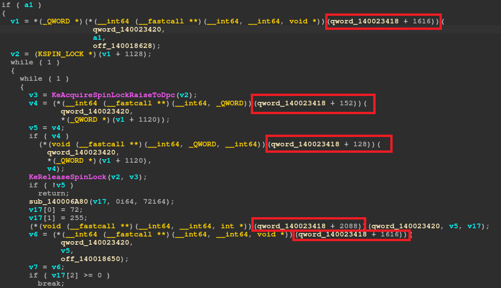
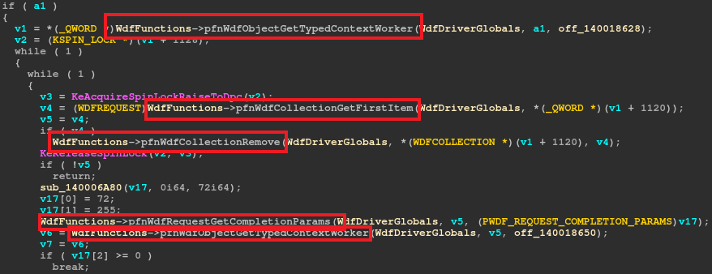

Ce plugin IDA se décompose en deux fonctionnalités : 

* la génération de fichiers .til, une bibliothèque de types, se basant sur les en-têtes du WDK mis à disposition par Microsoft
* l'application de ces types sur des points d'intérêt (notamment, les fonctions propres aux WDF) dans une base d'un driver KMDF

Ce plugin est une aide à l'analyse et apporte du confort lors de l'analyse d'un driver KMDF. Il permet de gagner du temps pour les étapes préliminaires d'une analyse.

Voici un extrait de code d'un driver WDF décompilé par IDA avant application du script :

Dans le code décompilé proposé par Hexrays, il est observé que certaines variables ne sont pas typées. Ainsi, les appels de fonction utilisant des pointeurs de fonction dans une structure ne sont pas directement interpretables. Il s'agit ici de typer ces variables et de profiter de la documentation de ces types fournie par Microsoft pour avoir une meilleure lecture de ces appels de fonctions.

Voici le même extrait après application du script :

Finalement, en typant ces variables, les appels de fonctions deviennent plus clairs.
